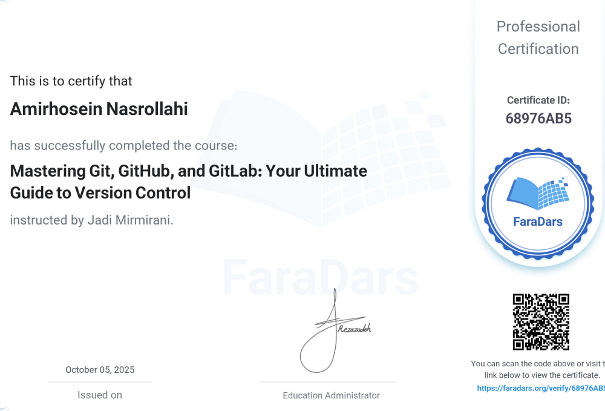

# Mastering Git — Professional Guide & Certification

A comprehensive yet concise **Git, GitHub, and GitLab guide** created after completing  
the **“Mastering Git, GitHub, and GitLab: Your Ultimate Guide to Version Control”** course (FaraDars, 2025).  

This repository represents the foundation of my future **MRI and PET medical image processing projects**,  
where version control and reproducibility are crucial for research integrity.

---

  

---

## 🧠 About Me

I’m **Amirhosein Nasrollahi**, a researcher in **medical image processing**, focusing on  
**MRI and PET** data analysis. I graduated from **Amirkabir University of Technology (Tehran Polytechnic)**  
and my work bridges medical imaging, AI-driven diagnostics, and reproducible research pipelines.

> 💬 Interests: Deep learning for neuroimaging, GNNs for tumor segmentation,  
> open-source collaboration, and scientific reproducibility.

---

## 📘 Repository Contents

| Folder | Description |
|---------|-------------|
| `/docs/` | Includes my concise Git guide and learning notes |
| `/assets/` | Contains certificate images and visual materials |
| `README.md` | Main overview of this repository |

### Key Materials
-✅ **Markdown Guide:** [git_guide.md](git_guide.md)
  (Covers Git fundamentals, branching, merging, rebase, conflict resolution, and collaboration models)
- 📜 **Certificate:** Proof of completion (FaraDars ID: **68976AB5**)  
  [Verify Certificate](https://faradars.org/verify/68976AB5)

---

## 🎯 Goals & Next Steps

- [ ] Add practical Git workflow examples (e.g., feature branching, rebase workflow)
- [ ] Include GitHub Actions for automation and CI/CD basics
- [ ] Document version control practices for **medical imaging pipelines**
- [ ] Add sample OpenSim or MRI data versioning demo
- [ ] Create a Persian version of the Git guide for Iranian research students

---

## 🧩 Why Git Matters in Medical Imaging Research

Reproducibility is a cornerstone of medical AI.  
Using **Git & GitHub** allows for:
- Transparent versioning of analysis scripts and datasets  
- Collaborative model development  
- Traceable documentation of image preprocessing and AI experiments

> _“If it’s not under version control, it doesn’t exist.”_

---

## ⚙️ Tech Stack & Tools

| Category | Tools |
|-----------|-------|
| Version Control | Git, GitHub, GitLab |
| Documentation | Markdown, GitHub Pages |
| Research Domains | Medical Imaging (MRI, PET), Deep Learning |
| Preferred Stack | Python, PyTorch, OpenCV, OpenSim |

---

## 🧩 License

This work is licensed under the **Creative Commons Attribution 4.0 International (CC BY 4.0)**.  
You are free to share and adapt the material with proper attribution.

---

## 🌐 Connect

- GitHub: [@AmirhoseinNasrollahi](https://github.com/AmirhoseinNasrollahi)  
- Email: [dcamirhoseinnsl@gmail.com](mailto:dcamirhoseinnsl@gmail.com)  
- Certificate Verification: [FaraDars ID 68976AB5](https://faradars.org/verify/68976AB5)

---
Stay tuned for future repositories focused on MRI/PET analysis, deep learning, and reproducible AI research.
