# Mastering Git — Concise Guide (Beginner → Advanced)

**Author:** Amirhosein Nasrollahi — *Certificate: Mastering Git, GitHub, and GitLab*  
**Purpose:** A compact yet comprehensive reference covering Git fundamentals, workflows, collaboration, signing, conflict resolution, and best practices — suitable for quick study or sharing alongside a certificate.

---
## Table of Contents
1. Introduction
2. Core Concepts
3. Basic Commands (cheat-sheet)
4. Common Workflows & Branching Strategies
5. Collaboration (Pull/Merge Requests, Reviews)
6. Advanced Topics (rewrite history, bisect, hooks)
7. Security: GPG signing commits
8. Conflict resolution & detached HEAD
9. Best Practices
10. Quick command reference table
11. Figures & Chart (Git workflow)

---
## 1. Introduction
Git is a distributed version control system designed for speed, data integrity, and support for non-linear workflows. Each clone is a full repository with history, allowing offline work and fast branching/merging.

## 2. Core Concepts
- **Repository (repo):** a folder with a `.git` directory that stores history and metadata.
- **Working directory:** your editable copy of the project files.
- **Staging area (index):** where `git add` places changes before committing.
- **Commit:** an immutable snapshot identified by a hash (SHA), contains metadata (author, message, parent).
- **Branch:** a movable pointer to a commit (used to isolate work).
- **Tag:** an immutable label to mark a specific commit (releases).
- **Remote:** a name that points to a remote repository URL (`origin` is the default).
- **HEAD:** a reference that points to the current checked-out commit or branch.

## 3. Basic Commands (with examples)
```bash
# Initialize repo or clone
git init                # create a new repo
git clone <url>         # copy a remote repo locally

# Work cycle
git status              # check working tree and staging area
git add <file>          # stage changes
git commit -m "msg"     # create a commit
git log --oneline       # view history
git diff                # see unstaged differences
git diff --staged       # staged differences

# Branching & switching
git branch              # list branches
git branch -m new-name  # rename branch
git checkout -b feat    # create+switch to branch (legacy)
git switch -c feat      # create+switch to branch (modern)

# Merge & rebase
git merge feature       # merge feature into current
git rebase main         # reapply commits onto main (rewrites history)

# Remote
git remote add origin <url>
git fetch origin
git pull origin main    # fetch + merge (or rebase if configured)
git push origin HEAD    # push current branch

# Tags
git tag v1.0
git push --tags

# Undo & history edits
git commit --amend      # change last commit message or content
git reset --soft <sha>  # move HEAD, keep changes staged
git reset --hard <sha>  # move HEAD and discard working changes
git revert <commit>     # create commit that undoes a commit (safe for published history)

# Debugging & blame
git bisect start
git bisect bad HEAD
git bisect good <sha>
# binary search to find commit that introduced bug

git blame -L 42,42 file  # find last commit that changed a specific line

# Stash
git stash               # save working changes temporarily
git stash pop           # reapply last stash

# Signing (brief)
git config --global user.signingkey <KEYID>
git config --global commit.gpgsign true
git commit -S -m "Signed commit"
```

## 4. Common Workflows & Branching Strategies
- **Feature-branch workflow:** each feature on its branch; use PR/MR to merge.
- **Fork-and-PR workflow:** contributors fork, push to their fork, open a pull request against upstream.
- **GitFlow:** defined long-lived branches (develop, release, hotfix); adds process overhead.
- **Trunk-based:** short-lived branches, frequent merges to main/trunk; favors continuous integration.

## 5. Collaboration
- **Pull Request / Merge Request:** propose changes; used for code review, CI runs, and discussion.
- **Code review:** prefer small PRs, clear description, and test coverage.
- **CI/CD:** integrate pipelines (GitHub Actions or GitLab CI) to run tests and deploy on merges.

## 6. Advanced Topics
- **Rewriting history:** `git rebase` and interactive rebase (`git rebase -i <base>`) can reorder, squash, or edit commits. Avoid rewriting published history shared with others.
- **Filter and large changes:** use `git filter-repo` or BFG to remove large files or rewrite author data (safer than `filter-branch`).
- **Hooks:** scripts in `.git/hooks` run on events (pre-commit, pre-push) to enforce checks.
- **Sparse checkout / Submodules / LFS:** specialized features for large repos and partial checkouts.

## 7. Security: GPG signing
1. Generate GPG key: `gpg --full-generate-key`
2. Find KEYID: `gpg --list-secret-keys --keyid-format LONG`
3. Configure Git: `git config --global user.signingkey KEYID`
4. Enable automatic signing: `git config --global commit.gpgsign true`
5. Export public key and add to hosting service (GitHub/GitLab) to show Verified badges.

## 8. Conflict resolution & detached HEAD
- Merge conflicts are marked with:
```
<<<<<<< HEAD
your changes
=======
other branch changes
>>>>>>> branch-name
```
Resolve manually, `git add` the resolved file and `git commit`.
- **Detached HEAD:** HEAD points to a commit instead of a branch. To keep work, create a branch: `git switch -c my-branch`.

## 9. Best Practices
- Write clear commit messages (use Conventional Commits if helpful): `type(scope): short summary`
- Make atomic commits (one logical change per commit).
- Avoid WIP commits for public history; clean up before merging.
- Use branches for isolation and small pull requests for reviewability.
- Run tests in CI and require passing CI before merging.

## 10. Quick Command Reference (table)

| Task | Command |
|---|---|
| Initialize | `git init` |
| Clone | `git clone <url>` |
| Status | `git status` |
| Stage file | `git add <file>` |
| Commit | `git commit -m "msg"` |
| View log | `git log --oneline` |
| Create branch | `git branch <name>` or `git switch -c <name>` |
| Merge | `git merge <branch>` |
| Push | `git push origin <branch>` |
| Pull | `git pull origin <branch>` |
| Tag | `git tag vX.Y` |
| Bisect | `git bisect start` |
| Blame line | `git blame -L <n>,<n> file` |
| Sign commits | `git commit -S` |

```mermaid
flowchart LR
  %% nodes (use longer IDs and quoted labels to avoid parser issues)
  nodeA["Init / Clone"]
  nodeB["Edit files"]
  nodeC["Stage
(git add)"]
  nodeD["Commit
(git commit)"]
  nodeL["Local tests"]
  nodeP["Push
(git push)"]

  nodeR["Open PR / MR"]
  nodeCI["CI: tests & lint"]
  nodeREV["Code Review"]
  nodeM["Merge into main"]
  nodeT["Tag / Release"]
  nodeDPL["Deploy (optional)"]

  %% local flow (one relation per line)
  nodeA --> nodeB
  nodeB --> nodeC
  nodeC --> nodeD
  nodeD --> nodeL
  nodeL -->|pass| nodeP
  nodeL -->|fail| nodeB

  %% remote flow
  nodeP --> nodeR
  nodeR --> nodeCI
  nodeCI -->|pass| nodeREV
  nodeCI -->|fail| nodeB
  nodeREV -->|approved| nodeM
  nodeREV -->|request changes| nodeB
  nodeM --> nodeT
  nodeT --> nodeDPL

  %% styling
  classDef localStyle fill:#f8f9fa,stroke:#333,stroke-width:1px;
  classDef remoteStyle fill:#eef6ff,stroke:#2c7be5,stroke-width:1px;
  class nodeA,nodeB,nodeC,nodeD,nodeL localStyle;
  class nodeP,nodeR,nodeCI,nodeREV,nodeM,nodeT,nodeDPL remoteStyle;
```



**Explanation:** This diagram shows the typical developer flow: local edit → stage → commit → local tests → push → open PR/MR → CI runs → code review → merge → tag/release → deploy. Arrows with labels indicate conditional outcomes (e.g., CI pass/fail).

### Further Reading
- Pro Git (book) — https://git-scm.com/book/en/v2
- GitHub / GitLab docs for platform-specific features (Actions/Pipelines, Merge Requests, Protected branches)
